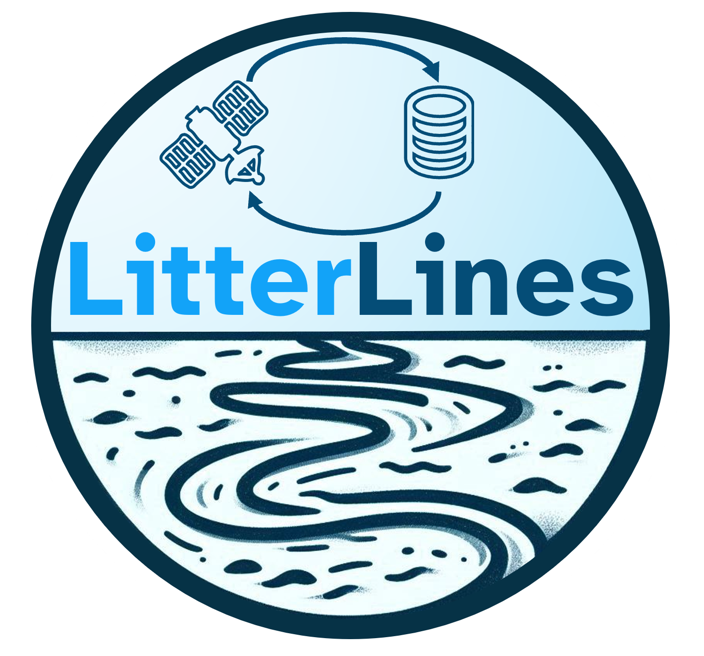

# LitterLines: An Annotated Dataset for Detection of Marine Litter Windrows in PlanetScope Imagery

<!-- let's add those when they are ready
[[`paper`](google.com)][[`demo`](google.com)][[`dataset`](google.com)]
-->

> **LitterLines** is a ready-to-analyze dataset for detecting **marine litter windrows (MLWs)** in **PlanetScope imagery**, consisting of **29 annotated scenes** with over **2.4 million labeled pixels**. Designed for **machine learning applications**, it enables the development and fine-tuning of models for MLW detection, supporting improved monitoring of marine litter from satellite-based sources. 

<p align="center">
  
  
</p>

---

## 1. Dataset Information  
- The dataset consists of **29 PlanetScope scenes**, acquired from Dove-C (22 scenes), SuperDove (6 scenes), and Dove-R (2 scenes) satellites.  
- Imagery is provided as *Analytic Ortho Scene* products with at-sensor radiance.  
- Conversion to top-of-atmosphere (TOA) reflectance can be performed using the provided repository code.  
- Data was collected between September 2024 and February 2025.  
- The dataset contains **1,016 image patches** (256×256 px) derived from 966 line annotations, using high-resolution PlanetScope imagery.  


## 2. Data Structure  
The dataset follows a hierarchical structure:  
```
LitterLines/
│── 20240115_Algeria/
│   ├── 100e/
│   │   ├── 20180123_100009_100e.json
│   │   ├── 20180123_100009_100e_3B_AnalyticMS_clip.tif
│   │   ├── 20180123_100009_100e_3B_AnalyticMS_metadata_clip.xml
│   │   ├── 20180123_100009_100e_3B_udm2_clip.tif
│   │   ├── 20180123_100009_100e_metadata.json
│   ├── 1018/
│   │   ├── 20180123_095909_1018.json
│   │   ├── 20180123_095909_1018_3B_AnalyticMS_clip.tif
│   │   ├── 20180123_095909_1018_3B_AnalyticMS_metadata_clip.xml
│   │   ├── 20180123_095909_1018_3B_udm2_clip.tif
│   │   ├── 20180123_095909_1018_metadata.json
│
│── 20201202_Egypt/
│   ├── 2264/
│   │   ├── 20201202_075858_57_2264.json
│   │   ├── 20201202_075858_57_2264_3B_AnalyticMS_clip.tif
│   │   ├── 20201202_075858_57_2264_3B_AnalyticMS_metadata_clip.xml
│   │   ├── 20201202_075858_57_2264_3B_udm2_clip.tif
│   │   ├── 20201202_075858_57_2264_metadata.json
```

### File Descriptions:
- **`metadata.json`**: contain acquisition details for each scene.  
- **`AnalyticMS.tif`**: contain 4-band GeoTIFF's (RGB and NIR) bands.
- **`AnalyticMS_metadata.xml`**: contain conversation factors for TOA reflectance
- **`udm2.tif`**: Usable Data Mask indicating valid pixels.  
- **Additional metadata for all samples** is compiled in **[`doc/litterlines_metadata.xlsx`](doc/litterlines_metadata.xlsx)**.  

---

## 3. Usage and Analysis  
- For **detailed documentation** on data retrieval and annotation, please contact Joost van Dalen.
- Preprocessing and model training can be facilitated using the **ready-to-analyze code** in the repository. 

---

## 4. Getting Started  

```bash
# Install LitterLines and its dependencies
pip install git+ssh://git@github.com/geoJoost/LitterLines.git

# Create and activate conda environment
conda create --n litterlines
conda activate litterlines

# Install dependencies
# Replace with appropriate PyTorch version

conda env update --f environment.yml
```

## 5. Dataloader Output  

The *LitterLines* dataset is designed for marine litter windrow detection, containing **1,016 image patches** (256×256 px). The datset is structured through a dataloader for ready-to-use machine learning applications, making it suitable for:  
- Fine-tuning pre-trained deep neural networks 
- Training machine learning models models  
- Analyzing spectral signatures of marine litter windrows

Below is a selection of image patches, visualized using RGB, NDVI, and RAI (Rotation-Absorption Index). The last column shows the annotation label used for training:  

<p align="center">
  
</p>  

The retrieval pipeline is modular, allowing for easy expansion and adaptation to different regions and sensor types.  


